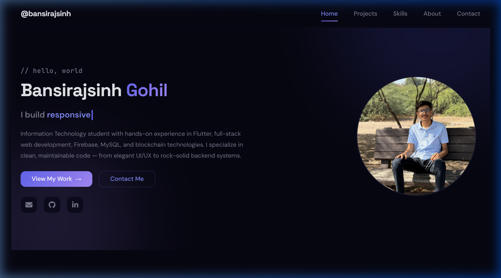
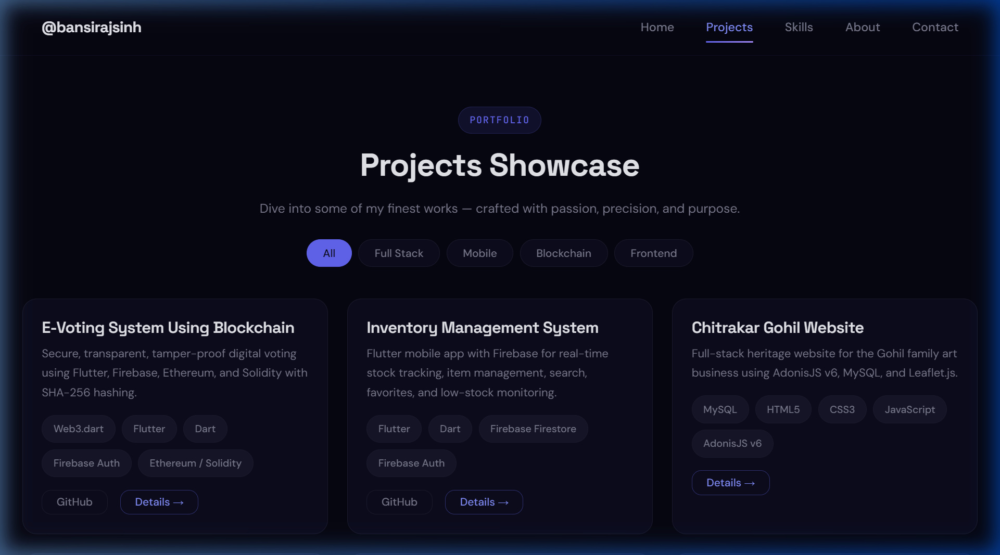
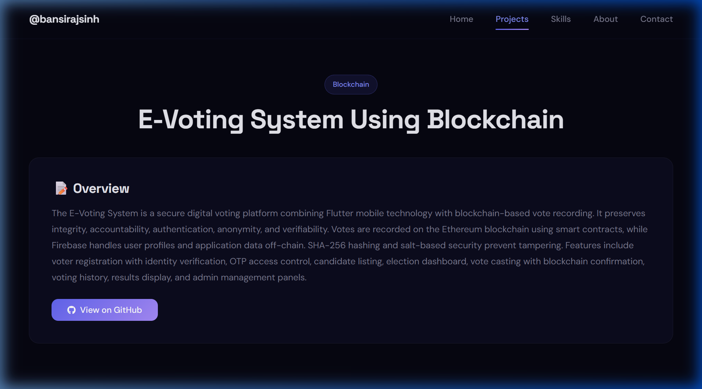
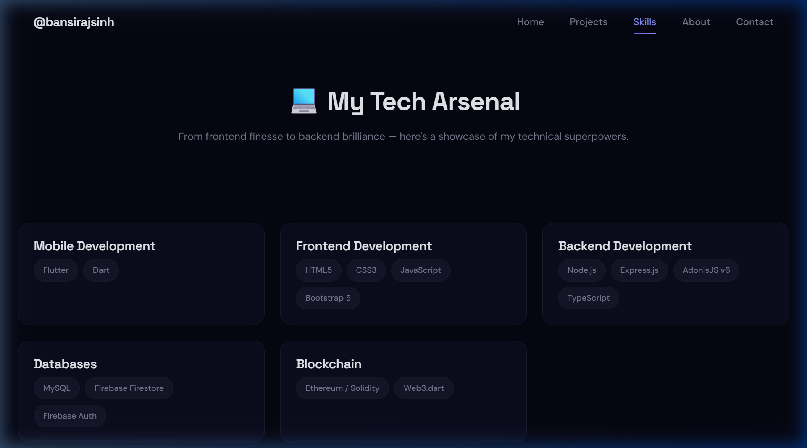
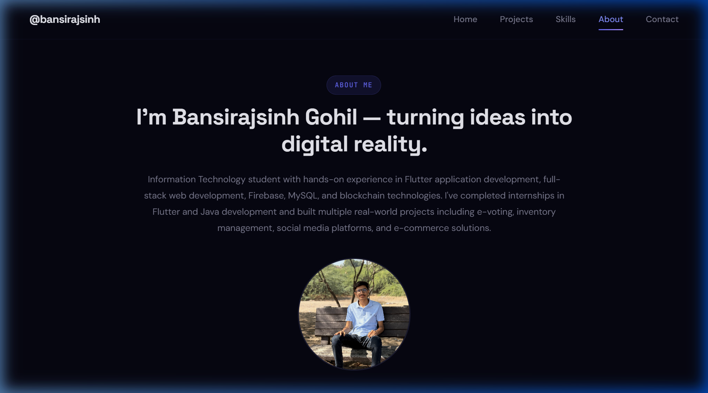
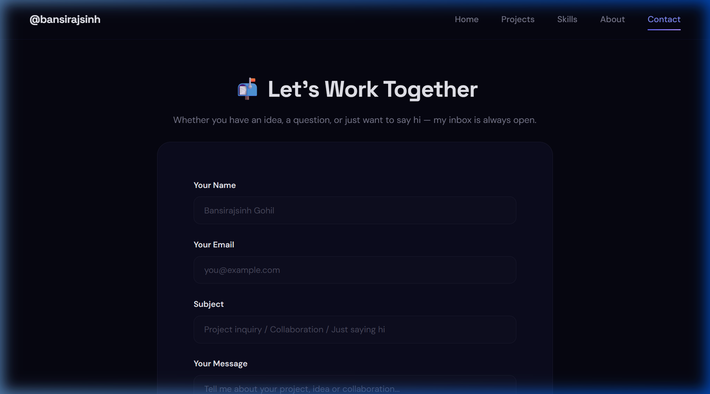

# 👨‍💻 Gohil Bansirajsinh — Professional Developer Portfolio


Welcome to the source code of my **Professional Developer Portfolio**. This application is a fully responsive, dynamically generated, full-stack website designed to showcase my projects, skills, and experience as a Flutter and Full-Stack Developer. 

---

## 🌟 Project Overview

Unlike static portfolios, this project is powered by a robust **Node.js/Express backend** and a **MySQL database**. All data (projects, skills, categories, profile details) is fetched dynamically via REST APIs, making it incredibly easy to update content without modifying the frontend code.

The frontend is built using pure **Vanilla HTML, CSS, and JavaScript**, entirely avoiding heavy frameworks to ensure lightning-fast performance, fine-grained control over animations, and a rich, modern, glassmorphism aesthetic.

---

## 📸 User Flow & Page Walkthrough

### 1. Home Page (`/`)
The landing page serves as the entry point. It features a modern hero section with dynamic typing effects, an avatar, and a quick summary. Below the fold, it highlights key statistics, featured skills, and top projects fetched directly from the database.


### 2. Projects Portfolio (`/projects`)
This page displays all projects pulled dynamically from the MySQL database. Users can seamlessly filter projects by category (e.g., Web, App, Blockchain) using the category tabs. Each project card features a beautiful hover effect, displaying its cover image, tags, and summary.


### 3. Project Details (`/projects/:slug`)
Clicking on any project brings the user to a dedicated, dynamically routed details page. This page provides an in-depth breakdown of the project, including a full description, the exact technologies used, links to the Live Demo and GitHub repository, and an image gallery.


### 4. Skills & Technologies (`/skills`)
A dedicated page that organizes technical proficiency. Skills are fetched from the backend and automatically grouped by categories (e.g., Languages, Frontend, Backend, Tools). 


### 5. About Me (`/about`)
Provides detailed background information, education history, and professional internship experience presented in a clean vertical timeline. 


### 6. Contact (`/contact`)
A functional contact form featuring client-side validation. When submitted, the backend handles the request and sends the message (integration ready). Includes quick access buttons to email, GitHub, and LinkedIn.


---

## 🏗️ Architecture & File Structure

```text
Portfolio/
├── assets/                  # Static assets (images, fonts, screenshots)
├── backend/                 # Node.js/Express Backend Server
│   ├── api/                 # REST API Route definitions
│   ├── config/              # Database & server configuration
│   ├── controllers/         # Business logic for handling API requests
│   ├── init_db.js           # Script to initialize database schema & seed data
│   ├── package.json         # Backend dependencies
│   └── server.js            # Express server entry point
├── css/                     # Styling (Vanilla CSS)
│   ├── style.css            # Global design tokens and base styles
│   ├── components.css       # Reusable UI components (buttons, cards)
│   └── responsive.css       # Media queries
├── html/                    # Frontend HTML Pages
├── js/                      # Frontend JavaScript Logic
│   ├── api.js               # Global API utility for fetching data
│   ├── app.js               # Global UI logic (navbar, animations)
│   └── ...                  # Page-specific scripts
├── package.json             # Root package.json to forward commands to backend
├── schema.sql               # Database Schema Definitions
└── seed.sql                 # Initial Database Seed Data
```

---

## 🚀 Setup & Installation (Local Development)

Follow these steps to run the portfolio website locally on your machine.

### Prerequisites
1. **Node.js** (v16 or higher)
2. **MySQL Server** (Running locally on port 3306, e.g., via XAMPP or native install)

### Step 1: Clone the Repository
```bash
git clone https://github.com/bansirajsinh/Portfolio.git
cd Portfolio
```

### Step 2: Install Dependencies
The dependencies are located in the `backend` folder. You can install them from the root directory using:
```bash
npm run install-all
```

### Step 3: Configure Environment Variables
Inside the `backend/` directory, create a `.env` file (or edit the existing one):
```env
PORT=3000
NODE_ENV=development

# MySQL Database Connection
DB_HOST=localhost
DB_PORT=3306
DB_USER=root          # Change if your MySQL user is different
DB_PASSWORD=          # Add your MySQL password if you have one
DB_NAME=portfolio_db
```

### Step 4: Initialize the Database
We have provided a script that automatically connects to your MySQL server, creates the database (`portfolio_db`), builds the tables from `schema.sql`, and fills it with data from `seed.sql`.

Run the following command from the `backend` folder:
```bash
cd backend
node init_db.js
cd ..
```
*(You should see a success message confirming the schema and seed data were executed).*

### Step 5: Start the Development Server
From the **root folder** (`Portfolio/`), simply run:
```bash
npm run dev
```

The application will start the Express server on `http://localhost:3000`. 
Open this URL in your browser to view the portfolio!

---

## 🎨 Technologies Used

- **Frontend:** HTML5, CSS3 (Variables, Grid, Flexbox, Animations), Vanilla JavaScript
- **Backend:** Node.js, Express.js
- **Database:** MySQL
- **Design:** Glassmorphism UI, Responsive Mobile-First Design, CSS Micro-animations

---
*Designed & Developed by [Bansirajsinh Gohil](https://github.com/bansirajsinh)*
